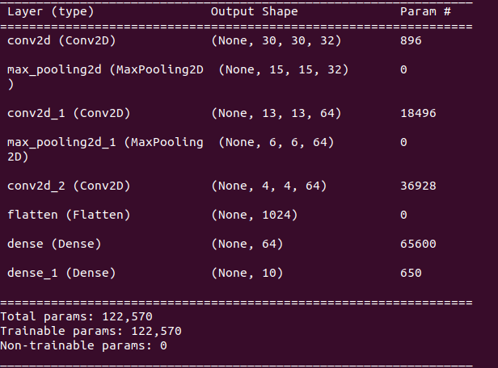
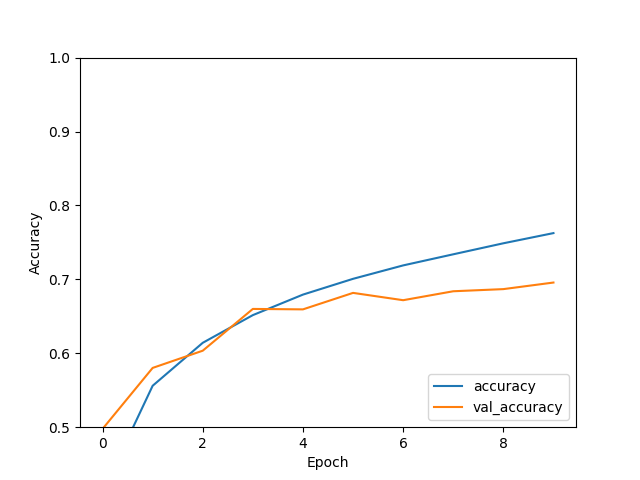
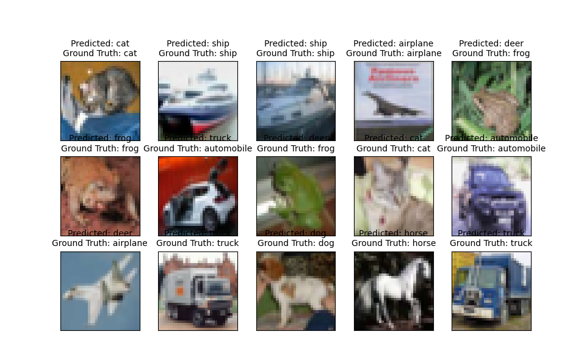

# CIFAR Image Classification with a simple Conv model

This is my first repo on the computer vision projects. The source to this project is from Tensorflow's [Tutorials](https://www.tensorflow.org/tutorials/images/cnn)

I have made some changes to the original source
1. Retrieved a part of the training data as the validation data instead of using test data as validation data.
2. Tried to increase the number of dense layers to 3 more with (64 units and 32 units)to try to get better accuracies and lower losses, but no luck improving these features.

This is a very basic model to start with, the model can be improved by adjusting hyperparameters, trying out other Architectures or probably by increasing the depth of the present model.

## How to run

Just make sure to install tensorflow, scikit-learn and numpy. I recommend you to use either venv or conda as a virtual environment to avoid conflicts later

For Scikit-learn `pip install -U scikit-learn`

For Numpy `pip install numpy`

For tensorflow, check [this](https://www.tensorflow.org/install/pip), Install the GPU version if you have GPU

Once installed, simply run `python model.py`

If you want to save/load model, just check out the code for doing the same.

## Results

Here's the model summary. As you can see, it's a simple model built by me. Will work on some complex models in the future!

Here's the accuracy graph. I tried running for more than 10 epochs but the val_accuracy isn't increasing with epochs. This model might not be complex enough for it to learn some distinguishing features. So val_accuracy is capped to 70%

Finally, just running the prediction with 15 test images.  11 out of 15 images has been detected right (around 73% accuracy! pretty good for a shallow model)

I'll continue working with more computer vision models ! See you all in another repo!
Parthan
