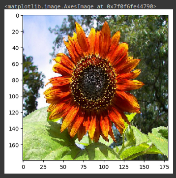
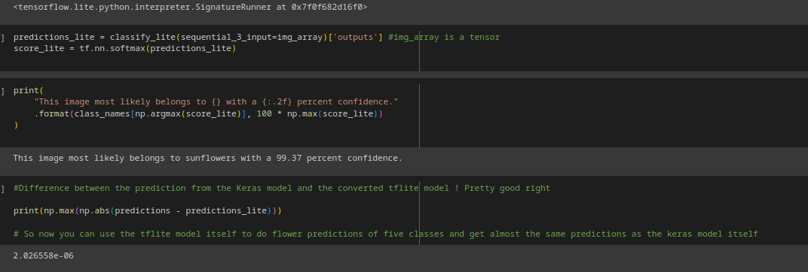

# Flower Classification with a simple Sequential model

This is my second repo on the computer vision projects. The source to this project is from Tensorflow's [Tutorials](https://www.tensorflow.org/tutorials/images/classification)

Some important learnings in this notebook

1. I have tried tweaking the dropouts from 0.1 to 0.5 with (0.2 seeming to be the best, just like the source)
2. Tried using data_augmentation to prevent overfitting to a good extent. Used RandomFlip,RandomRotation, RandomTranslation and RandomZoom
3. Made sure to use dataset.prefetch to help overlap data processing and model execution while training and dataset.cache to store the images in memory after the first epoch.

## How to run

I have run this on the Google Colab to avoid wasting time on installing dependencies. But if you want to run the notebook
Just make sure to install tensorflow, matplotlib, PIL and numpy. I recommend you to use either venv or conda as a virtual environment to avoid conflicts later

For Matplotlib `pip install matplotlib`

For PIL `pip install Pillow`

For Numpy `pip install numpy`

For tensorflow, check [this](https://www.tensorflow.org/install/pip), Install the GPU version if you have GPU

Once installed, you can run this on VSCode or directly installing jupyter notebook by `pip install notebook` and running
`jupyter notebook` from the directory in concern

If you want to save/load model, just check out the code for doing the same.

## Results

Here's the model summary of the two models used, one without dropout and one with it.

There's no change in the number of parameters, but has a huge difference in the fitting process.

Here's the accuracy graph. I tried running for 20 epochs with the model without dropout and not using data_augmentation but the val_accuracy isn't increasing beyond 0.7 and the val_error grows steep.

And then we use a dropout of 0.2 and data_augmentations techniques mentioned in the description above, and we get a pretty good increase in val_accuracy and big decrease in val_error for 20 epochs.

Also tested with different dropout rates from 0.1 to 0.5

Dropout=0.1

Dropout=0.2

Dropout=0.3

Dropout=0.4

Dropout=0.5

Dropout of 0.2 is seeming to be the better option compared to the other options above.

Finally, getting with one picture of a red sunflower using the tflite model interpreter. 

I must say, I am getting used to the idea of building neural nets. Though small, these are helping me get a better sense of inputting the data, augmenting, splitting into train and val, model building, compiling, fitting and receiving inference.

Next, I'll try something with a more mature model like MobileNet and try finetuning. :)